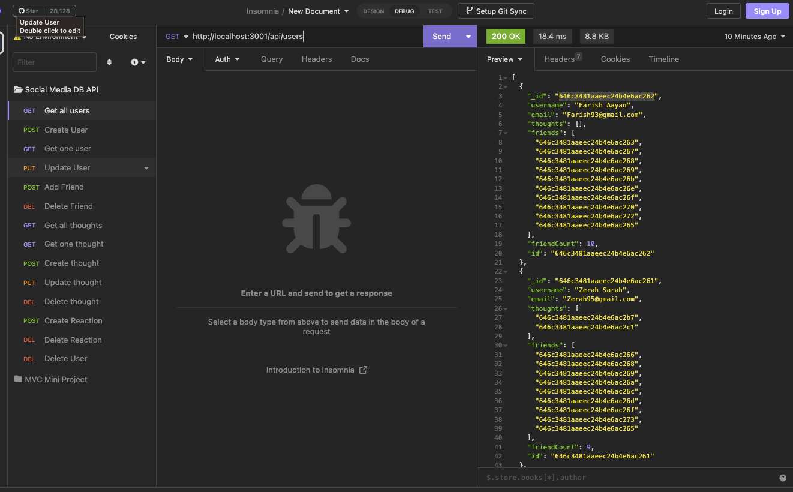

# Social Network DB API

## Table of Contents

- [Description](#description)
- [Installation](#installation)
- [Usage](#usage)
- [Technologies](#technologies)
- [Questions](#questions)

## Description

A small backend database and API for managing a set of users that can add each other as friends, create thoughts, and respond to thoughts with reactions.

## Installation

Clone the repo, cd into the directory, run "npm i" to install dependencies, run "npm run seed" to seed the database, run "npm run start" to initialize the service

## Usage

Use Insomnia or another API request tool to make custom requests to the API endpoints corresponding to those found in the "routes" folder. Alternatively, build a frontend platform that makes appropriate API calls to the service.

## Technologies

- Node.js
- Express.js
- MongoDB
- Mongoose

## See it in action!

[Video Demo](https://drive.google.com/file/d/1LP4Ntk9ppgmWdcW5_xHrv4kFKgBnyPvS/view)

## Questions

[My GitHub Profile](https://github.com/eschindev)

[Email me!](mailto:eschindler1993+dev@gmail.com)
